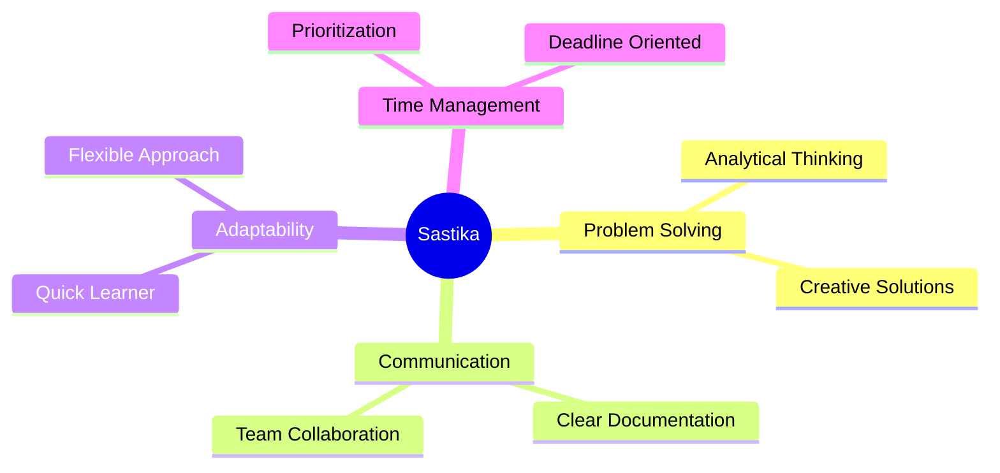

<div align="center">
  
# 👋 Hi, I'm **Sastika Regmi**

### 🎨 Web, App & Software Designer | UI/UX Specialist


[](https://sastikaregmi.com.np/)
[](https://www.linkedin.com/in/sastika-regmi)
[](mailto:sastikaregmi746@gmail.com)

📍 **Kathmandu, Nepal** | 🎓 **BIT Student @ NCMT College**

</div>

---

## 🚀 About Me

```typescript
const sastika = {
    role: "UI/UX Designer & Full-Stack Developer",
    education: "Bachelor of Information Technology (2023-2028)",
    location: "Kathmandu, Nepal",
    focus: ["User-Centered Design", "Information Architecture", "Interaction Design"],
    principles: ["Accessibility", "Usability", "Research-Driven Design"],
    currentlyWorking: "SEO & Digital Marketing @ Skippy Education",
    lifePhilosophy: "Design is not just what it looks like, design is how it works"
};
```

## 💼 Professional Experience

### 🌐 SEO & Digital Marketing Specialist (Remote)
**[Skippy Education/Visa](https://skippyeducation.com/)** | *2025 - Present*

- 🔍 Conducted comprehensive website audits and SEO analysis
- 🛠️ Resolved technical issues, content gaps, and UX bottlenecks
- 📈 Achieved **20% increase** in user satisfaction through performance optimization

---

## 🛠️ Tech Stack & Tools

### 💻 Programming Languages


### 🌐 Web Technologies


### 🗄️ Database


### 🎨 Design Tools


### 🔧 Development Tools


---

## 🎯 Featured Projects

<table>
<tr>
<td width="50%">

### 🛍️ [Durable Dress - E-Commerce](https://github.com/ssblucky7/e-shop)
**Tech:** React • Node.js • MongoDB • Cloudinary

Full-stack clothing store featuring:
- 🔐 Secure authentication & API
- 📦 Product management system
- ☁️ Cloud-based media storage
- 💳 Payment integration

</td>
<td width="50%">

### 📄 [SmartPDF Analyzer](https://github.com/ssblucky7/Smart-PDF-Web-App)
**Tech:** Python • Flask • Gemini API

AI-powered document analysis tool:
- 📝 PDF & image text extraction
- 🤖 AI-generated summaries
- 💡 Intelligent insights
- 🔍 Advanced search capabilities

</td>
</tr>

<tr>
<td width="50%">

### 📚 EdTech Learning Platform
**Tech:** React • TypeScript • Vite • Tailwind CSS

Modern educational platform with:
- 🌍 Multilingual support
- 🎓 Course creation & management
- 👥 Role-based access control
- 🤖 AI-powered features

</td>
<td width="50%">

### ☕ [Coffee Shop Website](https://github.com/ssblucky7/coffee-shop-ssblucky7)
**Tech:** HTML • CSS • JavaScript

Responsive landing page that:
- 📱 Mobile-first design
- 🎨 Modern UI/UX
- 📈 **40% increase** in online orders
- ⚡ Fast loading performance

</td>
</tr>
</table>

---

## 🏆 Achievements & Certifications

<div align="center">

| 🎖️ Achievement | 📅 Year | 🏅 Recognition |
|:---|:---:|:---|
| **NCMT College Hackathon Winner** | 2026 | 🥇 1st Place (Team: GenZ-Coder) |
| **NCMT College Hackathon Winner** | 2025 | 🏆 Winner |
| **HamroBazar Student Partnership** | 2024 | 🤝 Partnership |
| **SEO & Digital Marketing Certification** | 2023 | 📜 Certified |

</div>

---

## 📊 GitHub Stats

<div align="center">
  


</div>

---

## 🎓 Education

**Bachelor of Information Technology (BIT)**  
📍 [NCMT College](https://www.ncmtcollegenepal.edu.np) | Lincoln University  
📅 2023 - 2028

**Key Coursework:**
```
DSA • Networking • DBMS • AI • SAD • Digital Logic • SE • Cryptography
```

---

## 💡 Soft Skills

<div align="center">



</div>

**Languages:** 🇬🇧 English | 🇳🇵 Nepali | 🇮🇳 Hindi

---

## 📫 Let's Connect!

<div align="center">

I'm always open to discussing new projects, creative ideas, or opportunities to be part of your vision.

[](https://sastikaregmi.com.np/)
[](https://www.linkedin.com/in/sastika-regmi)
[](mailto:sastikaregmi746@gmail.com)

---

### ✨ *"Design is not just what it looks like and feels like. Design is how it works."* - Steve Jobs


</div>

---

<div align="center">
  
### 🌟 Thanks for visiting! Have a great day! 🌟


</div>
